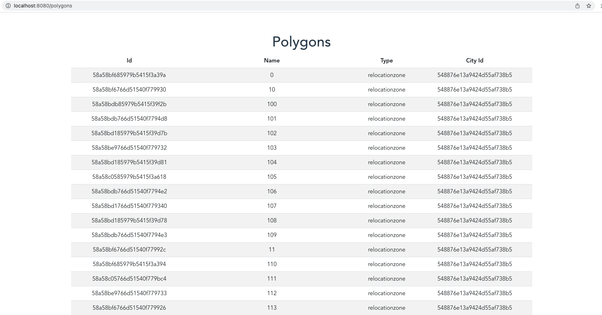

# Vehicle Application

The aim of this project is to fetch vehicles and polygons. The vehicle app folder consists of frontend and backend application to run both application in docker using docker-compose.yml file.

### Setup

#### Requirements

- Docker
- Gradle
- Java 17
- Intellij IDEA

##### 1 Run dockerized services

The project includes Vue.js application and Spring Boot application as docker containers. It takes about 3 to 5 minutes for all services to run on a computer.

In vehicleservice directory:

 ```sh
./gradlew clean test bootJar
 ```

Simply use:

 ```sh
$ docker-compose build
$ docker-compose up  #to run containerized services
$ docker-compose down
 ```
 
In addition to docker, `npm i` can be run to install package.json dependencies for local deployment.

##### Rest endpoints with Vue.js Application

Vue.js application is in vehicle-ui folder and can be monitored using 

`http://localhost:8080` : to fetch all vehicles for location Stuttgart.


`http://localhost:8080/polygons` : to fetch all polygons for location Stuttgart.



##### REST endpoints with Swagger UI

The vehicle serves run on `http://localhost:8081`.  The vehicles and polygons endpoints can be monitored using `http://localhost:8081/swagger-ui/index.html`.

The list of vehicles can be retrieved using the Get request section of Swagger UI.

##### Spring Boot Web Socket Implementation

In vehicle service, the WebSocketBrokerConfig class is defined to enable WebSocket and STOMP messaging in the config folder.

The method configureMessageBroker creates in-memory message broker with `topic` destination. The prefix `app` is used to filter destinations by methods annotated with /*@MessageMapping*/.

WebSocketController method is defined to broadcast messages to the client. Due to the limited time, the client side isn't implemented. Therefore, `http://localhost:8081/all/vehicles` throws error because of the lack of handshaking with client. 

Additionally, SimpMessagingTemplate can be added to vehicles endpoint in VehicleController class to broadcast messages with client implementation.  
 ```sh
@Autowired
SimpMessagingTemplate messagingTemplate;
 ```

 ```sh
@GetMapping(value = "/vehicles")
@Valid
@Scheduled(fixedDelay = 60000)
public List<VehicleDto> getAllVehicles() throws JsonProcessingException {
      List<VehicleDto> vehicles = vehicleService.getVehicleDataFromOpenAPI();
      messagingTemplate.convertAndSend("/all/vehicles", objectMapper.writeValueAsString(vehicles));
      return vehicles;
}
 ```

##### Cache UI for Vehicles and Polygons

The localStorage object is used to cache data for 5 minutes in the Polygons and Vehicles component. In spring boot side, @Scheduled(fixedDelay = 60000) is used to keep the data and update regularly.

#### Stop and Remove Containers

Simply use:

 ```sh
$ docker-compose down
 ```

##### Coulda/Woulda/Shoulda


- I could have implemented more integration and unit tests.
- I would have implemented Web Socket implementation for client side to fix Web Socket problems in my application.
- I would have added tests for deserialization for polygons json data.
- I would have implemented improved front-end part to enhance user experience.
- I would have added /*pagination*/ for tables in the Vue.js application for better view.
- I would have implemented map for polygons.